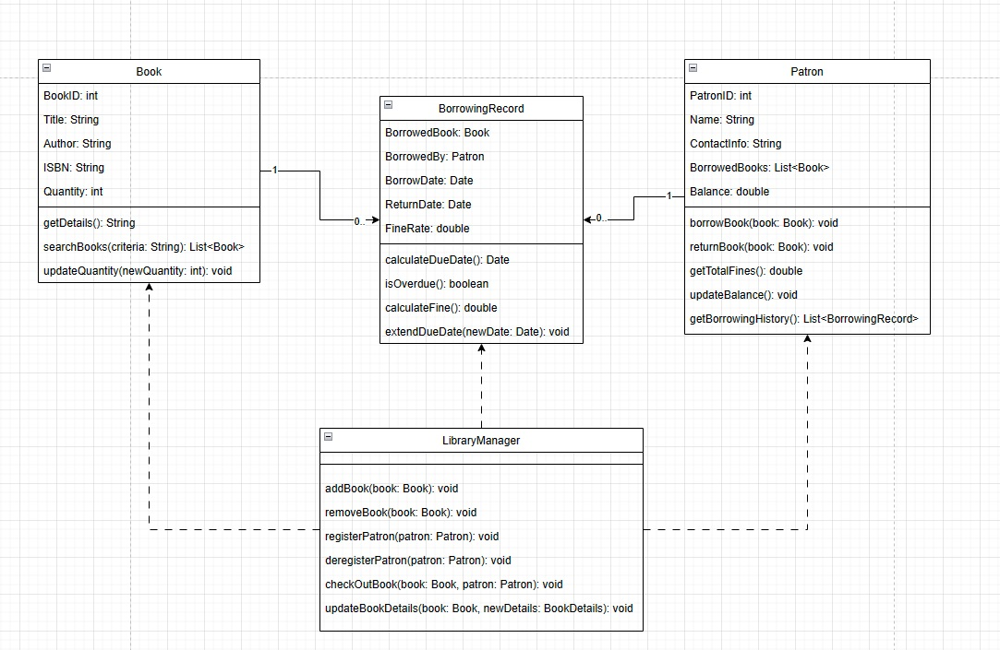

## Internship Problems

## Table of Contents

1. [Solution 1](#solution-1)
2. [Solution 2](#solution-2)

## Solution 1:

# Documentație Sistem de Gestionare a Bibliotecii

## Task 1: Diagrama de Clasă

### Prezentare Generală

Diagrama de clasă descrie arhitectura sistemului de gestionare a bibliotecii, dezvoltat folosind Entity Framework. Aceasta evidențiază relațiile și interconexiunile dintre obiectele din sistem, respectând constrângerile de integritate a datelor, precum cheile străine și relațiile de tipul one-to-many.

### Descrierea Claselor

#### Clasa `Book`

-   **Atribute**:
    -   `BookId`: Identificator unic al cărții.
    -   `Title`: Titlul cărții.
    -   `Author`: Autorul cărții.
    -   `ISBN`: Codul ISBN al cărții.
    -   `Quantity`: Cantitatea disponibilă în bibliotecă.
-   **Relații**:
    -   `BorrowingRecords`: O colecție care urmărește împrumuturile cărții.
-   **Metode**:
    -   `IsAvailable`: Verifică disponibilitatea cărții pentru împrumut.

#### Clasa `Patron`

-   **Atribute**:
    -   `PatronId`: Identificator unic al utilizatorului.
    -   `Name`: Numele utilizatorului.
    -   `ContactInformation`: Informații de contact.
-   **Relații**:
    -   `BorrowingRecords`: Înregistrează împrumuturile utilizatorului.

#### Clasa `BorrowingRecord`

-   **Funcție**: Înregistrează detaliile împrumutului între cărți și utilizatori.
-   **Atribute**:
    -   Datele împrumutului și returnării.

#### Clasa `LibraryManager`

-   **Funcție**: Coordonează operațiunile principale ale sistemului.
-   **Metode**:
    -   Gestionarea cărților și generarea rapoartelor.


_Diagrama de Clasă_

## Task 2: Relațiile și Structura Bazei de Date

### Relații

-   **Relația `Book`-`BorrowingRecord`**
    -   Fiecare carte poate avea mai multe `BorrowingRecord`.
    -   Reprezentată prin foreign key `BookId` în `BorrowingRecord`.
-   **Relația `Patron`-`BorrowingRecord`**:
    -   Fiecare `Patron` poate avea mai multe `BorrowingRecord.
    -   Reprezentată prin foreign key `PatronId` în `BorrowingRecord`.
-   **Tabelul `BorrowingRecord`**:
    -   Funcționează ca un tabel de legătură între `Book` și `Patron`.

### Codul SQL pentru Taberele

```sql
CREATE TABLE Books (
    BookId INT PRIMARY KEY IDENTITY,
    Title NVARCHAR(255),
    Author NVARCHAR(255),
    ISBN NVARCHAR(20),
    Quantity INT
);

CREATE TABLE Patrons (
    PatronId INT PRIMARY KEY IDENTITY,
    Name NVARCHAR(255),
    ContactInformation NVARCHAR(255)
);

CREATE TABLE BorrowingRecords (
    BorrowingRecordId INT PRIMARY KEY IDENTITY,
    BookId INT,
    PatronId INT,
    BorrowedDate DATETIME,
    DueDate DATETIME,
    ReturnedDate DATETIME NULL,
    FOREIGN KEY (BookId) REFERENCES Books(BookId),
    FOREIGN KEY (PatronId) REFERENCES Patrons(PatronId)
);
```


<br>

## Solution 2:

# Documentația Designului Logic al Aplicației de Quiz

## Task 1: Logical Design

### Prezentare Generală

Această Aplicație de Quiz este o aplicație web interactivă și dinamică, care generează și prezintă întrebări din baza de date Open Trivia Database. Este proiectată pentru a menține scorurile, pentru a asigura lipsa repetițiilor întrebărilor și pentru a oferi o experiență atractivă utilizatorului.

## Componente

Aplicația constă în mai multe componente cheie:

### 1. `DataManager`

-   **Responsabilitate**: Gestionarea apelurilor API către Open Trivia Database (`https://opentdb.com/api.php`).
-   **Funcționalitate**:
    -   Aduce un set de întrebări bazate pe parametri specificați, cum ar fi categoria și dificultatea.
    -   În cazul unei defecțiuni a API, recuperează un set simulat de întrebări de la clasa `QuizBank`.

### 2. `Question`

-   **Responsabilitate**: Reprezintă o singură întrebare din quiz.
-   **Funcționalitate**:
    -   Maparea datelor JSON din API în clasa `Question`.
    -   Decodifică entitățile HTML pentru a preveni afișarea caracterelor HTML brute.
    -   Amestecă ordinea răspunsurilor pentru fiecare întrebare.

### 3. `Quiz`

-   **Responsabilitate**: Gestionează logica generală a quiz-ului.
-   **Funcționalitate**:
    -   Începe quiz-ul și prezintă întrebările utilizatorului.
    -   Selectează întrebări aleatorii și asigură lipsa repetițiilor.
    -   Gestionează trimiterea răspunsurilor și tranziția între întrebări.
    -   Încheie quiz-ul și apelează `Scoreboard` pentru actualizarea scorurilor.

### 4. `UIManager`

-   **Responsabilitate**: Gestionează toate interacțiunile UI.
-   **Funcționalitate**:
    -   Afișează întrebările și opțiunile de răspuns.
    -   Actualizează UI-ul în funcție de interacțiunile utilizatorului (de exemplu, selectarea unui răspuns, trecerea la următoarea întrebare).
    -   Gestionează afișarea scorurilor și sumarele de la sfârșitul quiz-ului.

### 5. `Scoreboard`

-   **Responsabilitate**: Urmărește și gestionează scorurile.
-   **Funcționalitate**:
    -   Incrementează scorul utilizatorului pentru răspunsurile corecte.
    -   Salvează scorurile mari în stocarea locală și le actualizează dacă scorul curent depășește scorurile anterioare.

## Logica Principală (`main.js`)

-   Inițializează toate componentele (`DataManager`, `Question`, `Quiz`, `UIManager`, `Scoreboard`).
-   Ascultă evenimentul de începere a quiz-ului și recuperează inputurile utilizatorului (numele de utilizator, categoria, dificultatea).
-   Aduce întrebările folosind `DataManager` și începe quiz-ul folosind clasa `Quiz`.

## Fluxul Logic

1. **Inițializare**: Inputurile utilizatorului sunt colectate, iar `DataManager` aduce întrebările.
2. **Start Quiz**: După aducerea cu succes a întrebărilor, clasa `Quiz` se inițializează și începe să prezinte întrebări.
3. **Gestionarea Întrebărilor**: Fiecare întrebare este prezentată individual. Clasa `Question` asigură că răspunsurile sunt amestecate.
4. **Interacțiunea Utilizatorului**: Utilizatorii trimit răspunsuri, care sunt procesate pentru a actualiza scorurile și pentru a determina pașii următori.
5. **Urmărirea Progresului**: Aplicația urmărește numărul de întrebări răspunse și asigură că nu există repetiții.
6. **Sfârșitul Quiz-ului**: Odată ce toate întrebările sunt răspunse, quiz-ul se încheie. Scorul final este afișat, iar scorurile mari sunt actualizate dacă este necesar.


<br>

## Task 2: Logical Design

## Prezentare Generală

Această documentație descrie implementarea unei Aplicații de Quiz care preia întrebări de la Open Trivia Database API, le procesează și le afișează, și calculează scorurile utilizatorilor.

## Pași Cheie în Implementare

### 1. Extragerea Întrebărilor din API

-   **Proces**: Aplicația inițiază prin efectuarea unui apel către Open Trivia Database API.
-   **Scop**: Pentru a recupera un set diversificat de întrebări de quiz bazate pe parametri specificați, cum ar fi categoria și dificultatea.

### 2. Maparea Răspunsului API în Clasa `Question`

-   **Funcționalitate**:
    -   Fiecare întrebare primită de la API este transformată într-o instanță a clasei `Question`.
    -   Acest proces include decodarea entităților HTML și pregătirea întrebării pentru afișare.

```javascript
constructor(questionData, id) {
        this.id = id
        this.category = questionData.category
        this.text = this.decodeHtmlEntities(questionData.question)
        this.correctAnswer = this.decodeHtmlEntities(questionData.correct_answer)
        this.options = [...(questionData.incorrect_answers ?? []).map((ans) => this.decodeHtmlEntities(ans)), this.correctAnswer]
        this.randomizeAnswerOrder()
    }
```

### 3. Amestecarea Răspunsurilor

-   **Metodă**: Metoda `randomizeAnswerOrder` din clasa `Question` folosește algoritmul de amestecare Fisher-Yates.
-   **Scop**: Pentru a asigura că opțiunile de răspuns sunt prezentate într-o ordine aleatorie pentru fiecare întrebare, prevenind orice modele previzibile.

```javascript
    randomizeAnswerOrder() {
        for (let i = this.options.length - 1; i > 0; i--) {
            const j = Math.floor(Math.random() * (i + 1))
            ;[this.options[i], this.options[j]] = [this.options[j], this.options[i]]
        }
    }
```

### 4. Alegerea unei Întrebări la Întâmplare

-   **Inițializare**:
    -   Clasa `Quiz` se inițializează cu un array de obiecte întrebare.
    -   Un array de indici (`remainingIndices`) este creat pentru a urmări ce întrebări au fost utilizate.
-   **Selectarea Întrebărilor Aleatorii**:
    -   Metoda `getRandomQuestion` selectează un index aleatoriu din `remainingIndices` folosind `getRandomIndex`.
    -   Odată ce o întrebare este selectată, indexul său este eliminat din `remainingIndices` pentru a preveni repetiția.

```javascript
    getRandomIndex() {
        const randomPos = Math.floor(Math.random() * this.remainingIndices.length)
        return this.remainingIndices.splice(randomPos, 1)[0]
    }

    getRandomQuestion() {
        if (this.remainingIndices.length === 0) {
            return null
        }
        const randomIndex = this.getRandomIndex()
        return this.questions[randomIndex]
    }
```

### 5. Afișarea Întrebărilor și Calculul Scorului

-   **Flux**:
    -   Quiz-ul afișează continuu următoarea întrebare până când toate întrebările din `remainingIndices` sunt epuizate.
-   **Sfârșitul Quiz-ului**:
    -   La finalizare, scorul final al utilizatorului este calculat și afișat, reflectând numărul de întrebări la care s-a răspuns corect.


<br>


<br>


<br>


<br>
